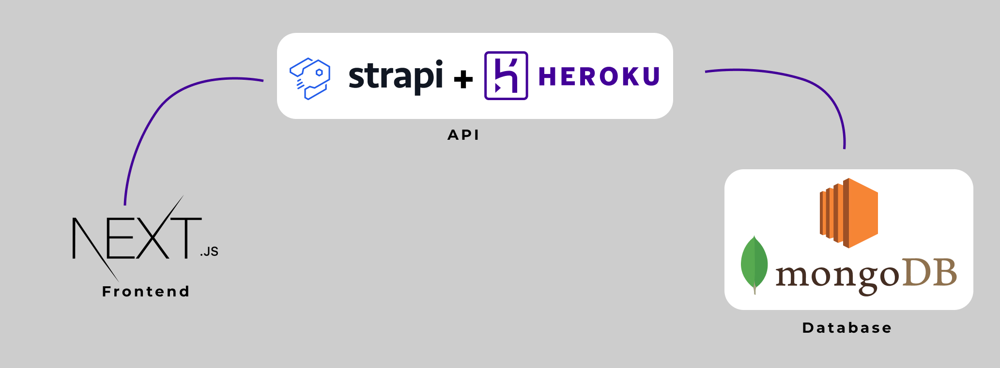

# My personal blog

Fiz um remake no meu blog antigo que era feito em gatsby. Básicamente a nova arquitetura que utilizei é:

- Frontend: Next.js
- Backend: Strapi
- Banco de dados: Mongodb

**Desenho Arquitetura**

